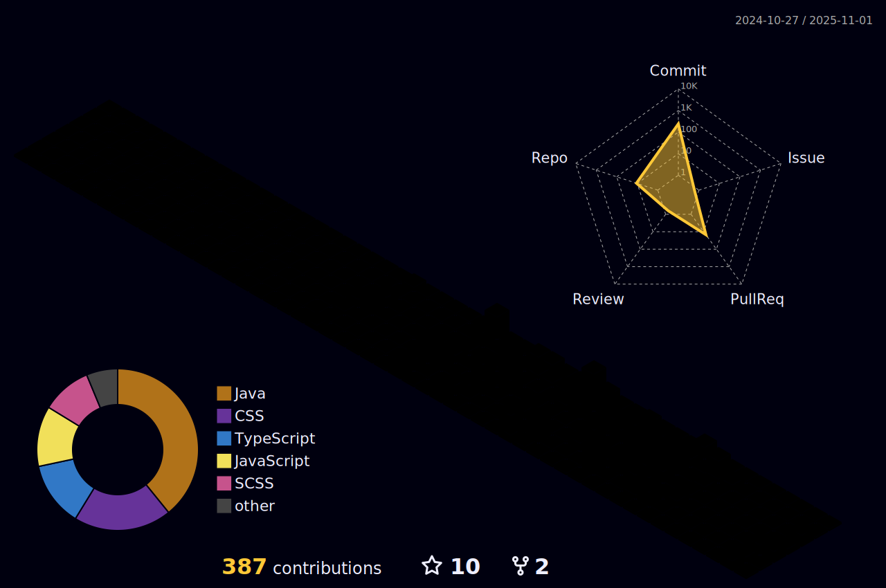

# 👋 Olá, eu sou Sara Cristina!

  

  

---

## 🚀 Sobre mim

💻 Desenvolvedora Full Stack especializada em React/Next.js e Java  
🎯 Experiência em desenvolvimento frontend moderno com TypeScript e Angular  
📚 Focada em criar aplicações robustas com testes automatizados  
🌱 Sempre explorando as melhores práticas em desenvolvimento web  

---

## 📊 Estatísticas do GitHub

  
  
  

  

---

## 🛠️ Tecnologias & Ferramentas

### Linguagens de Programação

### Frontend

### Bibliotecas & Frameworks

### Testes

### Ferramentas & Versionamento

---

## 🌟 Projetos em Destaque

  

> 💡 **Dica**: Substitua "seu-projeto-principal" pelo nome do seu repositório mais importante!

---

## 📈 Atividade no GitHub

  

---

## 🤝 Vamos nos conectar?

---

  
### 💭 *"O código é poesia em movimento, cada linha uma expressão de criatividade e lógica."*

**Obrigada pela visita! 🚀**

